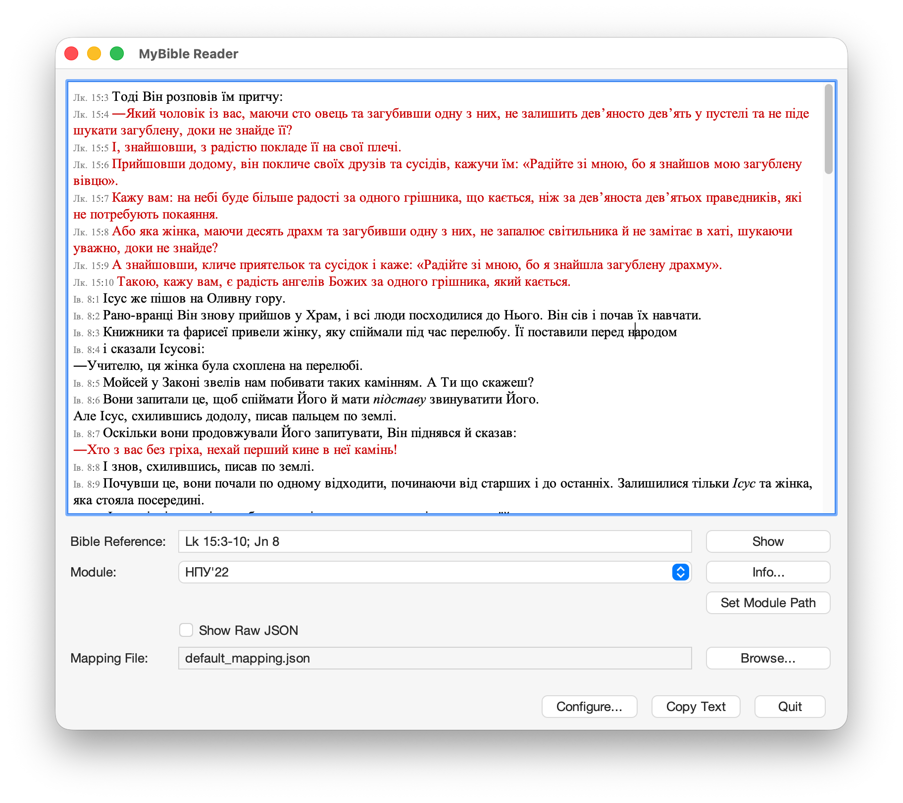
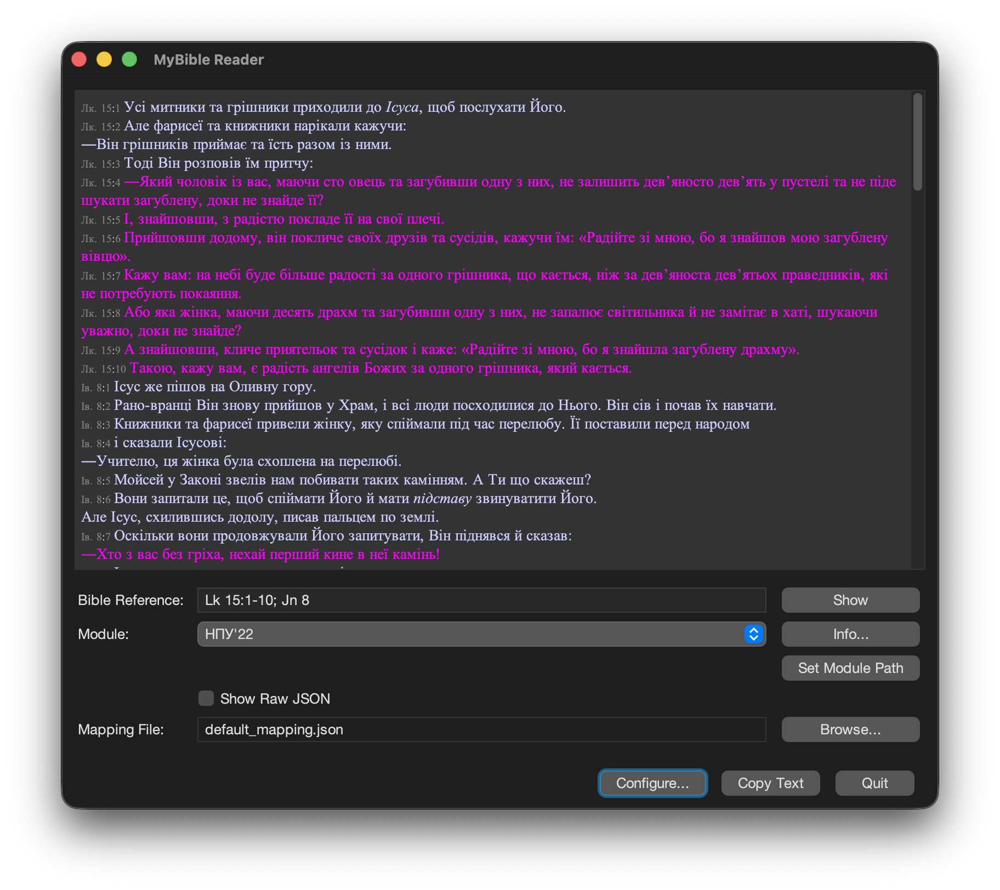

# MyBible-CLI (MyBible Reader, Java Edition)

This is a cross-platform Java application for getting text from [MyBible](https://mybible.zone) modules (`.sqlite3` files).

## Purpose and Motivation

This project was inspired by [`diatheke`](https://wiki.crosswire.org/Frontends:Diatheke), the standard command-line tool for [Crosswire Sword](http://www.crosswire.org/sword/index.jsp) modules. While powerful, `diatheke` works only with Crosswire Sword modules and does not support the [MyBible format](https://mybible.zone/modules/), which has an extensive library of high-quality modules.

The primary goal of MyBible-CLI is to provide a fast and comprehensive command-line interface (CLI) for quick access to biblical text. It is not designed as a Bible **study** tool but rather as an auxiliary and quick way to retrieve biblical text for use in other applications. Currently, only Bible modules are supported; other types, such as commentaries or dictionaries, are not. For searches and text analysis, the command-line output from MyBible-CLI can be piped to other tools, so neither the CLI nor the GUI mode includes built-in search functionality.

## Features

### Command-Line Interface (CLI)

*   **Fast Verse Fetching**: Quickly retrieve and display Bible verses from any MyBible module.
*   **Advanced Output Formatting**: Use a flexible format string to control the exact output for verses, book names, and references.
*   **Customizable Book Name Mappings**: Use the default book name abbreviations or create your own custom mapping files for different languages.
*   **Easy Configuration Management**: A simple `open` command allows you to instantly open the configuration and module folders in your system's file explorer.

### Graphical User Interface (GUI)

*   **Simple and Intuitive UI**: A clean, themeable interface (with light/dark modes) designed for quick lookups.
*   **Customizable Text Display**: Adjust fonts, colors, and styles for verse text, numbers, words of Jesus, and other elements.
*   **Easy Configuration**: Visually set the module path and select custom book name mappings.
*   **Convenient Actions**: Copy formatted text in both rich and plain text formats and for use in other applications and use standard keyboard shortcuts for navigation.
<p>
  
  
</p>

## Usage

You can interact with the application via the executable JAR (`java -jar mybible-cli.jar ...`) or through a platform-specific launcher. For brevity, the examples below use `mybible-cli.jar`.

### CLI Mode

The CLI is the originally intended way to use the application and is ideal for scripting and quick lookups and biblical text retreival from other tools. Below are some examples of its usage.

#### `get` - Fetch Verses

This is the main command for fetching verses. The module path must be set for this command to work. This can be done with the [`list` command](#list-bookmark) or [in the GUI](#guipath-bookmark).

```bash
# Get a single verse from the last-used module
java -jar mybible-cli.jar get -r "Rom 8:28"

# Specify a module and a verse range
java -jar mybible-cli.jar get -m NET -r "Eph 2:8-10"

# Use a custom output format
java -jar mybible-cli.jar get -m KJV -r "Ps 23" -f "%c:%v %t"
```

#### <a id="list-bookmark"></a>`list` - Manage Modules

Lists all available modules. If run with the `--path` option, it sets the modules directory for all future runs.

```bash
# List all found modules
java -jar mybible-cli.jar list

# Set the path to your MyBible modules directory for the first time
java -jar mybible-cli.jar list --path "/path/to/your/MyBible/modules"
```

#### `open` - Open Folders

Quickly opens the application's configuration or modules folder in your system's file manager.

```bash
# Open the configuration directory
java -jar mybible-cli.jar open config
```

#### `parse` - Test References

A utility command to see how the application parses a Bible reference string, showing book names, chapter/verse ranges, and total verse count.

```bash
# See how a complex reference string is parsed
java -jar mybible-cli.jar parse -r "1 John 1:9-11; Jn 3:16"
```

#### `help` - Get Help

Shows detailed information about commands and other features.

```bash
# List all available help topics
java -jar mybible-cli.jar help

# Learn how to use the 'get' command
java -jar mybible-cli.jar help get

# See all supported format specifiers
java -jar mybible-cli.jar help format
```

### GUI Mode

The GUI provides a simple visual alternative for looking up verses.

**Launch the GUI:**

*   By starting the platform-specific application for your OS.
*   From the terminal:
    ```
    java -jar mybible-cli.jar gui
    ```
Either method will open the MyBible Reader window. If the module path has not been set, use the <a id="guipath-bookmark"></a>**Set Module Path** button to select your modules directory.

**Launch the GUI with Pre-loaded Text:**

You can also start the GUI with a specific passage already loaded.

```bash
java -jar mybible-cli.jar gui -m KJV -r "Jn 3:16"
```

**GUI Keyboard Shortcuts:**

| Shortcut                 | Action                                     |
| :----------------------- | :----------------------------------------- |
| `Esc`                    | Quit the application                       |
| `Ctrl`/`Cmd` + `L`       | Focus the "Bible reference" input field    |
| `Ctrl`/`Cmd` + `M`       | Focus the "Module" dropdown list           |
| `Ctrl`/`Cmd` + `J`       | Toggle raw JSON output                     |
| `Ctrl`/`Cmd`+`Shift`+`C` | Copy displayed text (with formatting)      |
| `Cmd` + `,` (macOS)      | Open the Configuration dialog              |

## Configuration

The application uses `config.json` and `gui.json` files stored in a standard system location:

*   **Windows**: `%APPDATA%\mybible-cli-java\`
*   **macOS**: `~/Library/Application Support/mybible-cli-java/`
*   **Linux**: `~/.config/mybible-cli-java/`

These files store GUI settings (themes, styles) and CLI settings (default format string, modules path).

## Output Formatting

Both the GUI and CLI use a format string to control the appearance of the output.

*   In **CLI mode**, specifiers like `%X`, `%Y`, and `%Z` use ANSI color codes for terminal display.
*   In **GUI mode**, these same specifiers render rich text, whose fonts and colors can be customized in the configuration dialog.

Both modes also support outputting the requested reference text as raw JSON data. The behavior differs slightly between the CLI and GUI:

*   CLI: Outputs the JSON to standard output, allowing it to be piped directly into other scripts and tools for automated workflows.

*   GUI: Renders the JSON in the text area. This is useful for quickly inspecting a module's raw content, such as to verify the presence of Strong's numbers, footnotes, or other formatting tags.

    In both cases, the JSON contains the unprocessed verse text, identical to the output of the %T format specifier.

| Specifier | Description                                                      |
| :-------- | :--------------------------------------------------------------- |
| **Reference** |                                                              |
| `%a`      | Default abbreviated book name (e.g., 'Jn')                       |
| `%f`      | Default full book name (e.g., 'John')                            |
| `%A`      | Module-specific abbreviated book name                            |
| `%F`      | Module-specific full book name                                   |
| `%b`      | Book number per MyBible specifications (e.g., 500 for John)      |
| `%c`      | Chapter number                                                   |
| `%v`      | Verse number                                                     |
| `%m`      | Module name                                                      |
| **Text Content** |                                                           |
| `%T`      | Raw verse text, including all original module markup.            |
| `%t`      | Cleaned, multi-line plain text with paragraph breaks preserved.  |
| `%z`      | Cleaned, single-line plain text with all tags and breaks removed.|
| **Formatted Text** |                                                         |
| `%X`      | Multi-line text with formatting and Strong's numbers.            |
| `%Y`      | Multi-line text with formatting, without Strong's numbers.       |
| `%Z`      | Single-line text with formatting, without Strong's numbers.      |

## Building the Application

This project is built using Gradle.

1.  **Prerequisites**: You will need a Java Development Kit (JDK), version 17 or higher.
2.  **Build Command**: Navigate to the project root and run the following command:

    ```bash
    ./gradlew clean shadowJar
    ```
3.  **Output**: The command will produce a single, executable JAR file at `build/libs/mybible-cli.jar`.

## Credits and Thanks

This tool would not be possible without the incredible work done by the creators of the [MyBible](https://mybible.zone) project.  
The **MyBible** name, icon and module format are the intellectual property of the MyBible project.

This application was also inspired by [`diatheke`](https://wiki.crosswire.org/Frontends:Diatheke) and the [Crosswire Sword](http://www.crosswire.org/sword/index.jsp) project.

A good place to get MyBible modules is the [ph4.org website](https://www.ph4.org/b4_index.php?hd=b).
