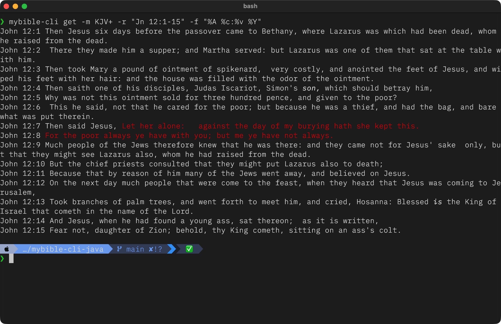
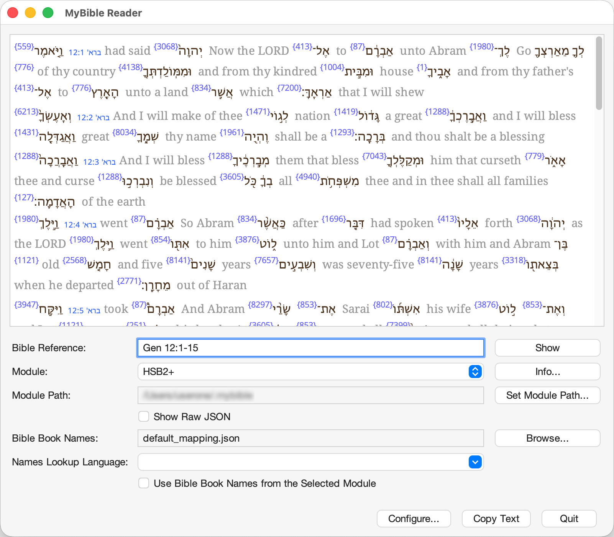
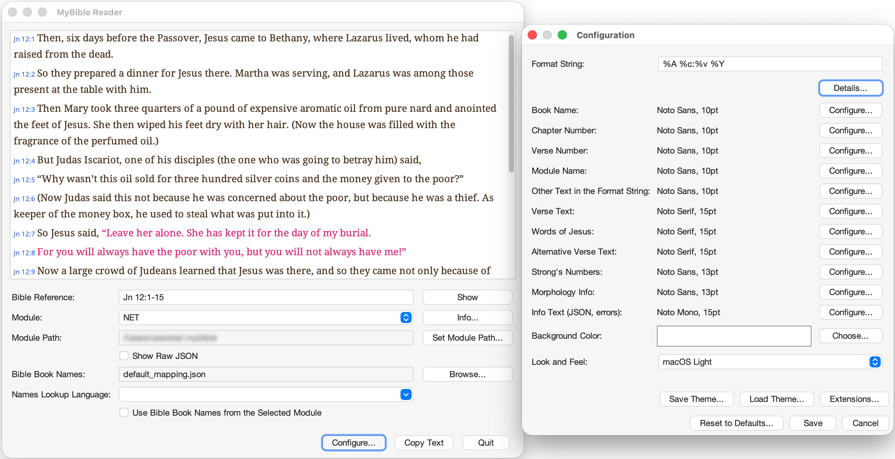

# Output Formatting

Both the GUI and CLI use a powerful format string to control the appearance of the output.

## Rendering: CLI vs. GUI

The output rendering is optimized for each environment:

*   **CLI mode:** Specifiers `%X`, `%Y`, and `%Z` use ANSI color codes for a rich display directly in your terminal.
<p>
  
  
</p>
*   **GUI mode:** These same specifiers render as rich text. The fonts, colors, and styles for different elements (like verse numbers or words of Jesus) can be fully customized in the configuration dialog.
<p>
  
  
</p>

## JSON Output

Both modes also support outputting the requested reference text as raw JSON data.

*   **CLI:** Using the `--json` flag outputs the JSON to standard output. This can be helpful if you need structured output for further post-processing.
*   **GUI:** Selecting the "Raw JSON" checkbox renders the JSON in the text area. This is useful for quickly inspecting a module's raw content, such as verifying the presence of Strong's numbers, footnotes, or other formatting tags.

In both cases, the JSON contains the unprocessed verse text, identical to the output of the `%T` format specifier.

## Format Specifiers

The following specifiers can be used in the format string:

| Specifier      | Description                                                      |
| :------------- | :--------------------------------------------------------------- |
| **Reference**  |                                                                  |
| `%a`           | Default abbreviated book name (e.g., 'Jn')                       |
| `%f`           | Default full book name (e.g., 'John')                            |
| `%A`           | Module-specific abbreviated book name                            |
| `%F`           | Module-specific full book name                                   |
| `%b`           | Book number per MyBible specifications (e.g., 500 for John)      |
| `%c`           | Chapter number                                                   |
| `%v`           | Verse number                                                     |
| `%m`           | Module name                                                      |
| **Text Content** |                                                                |
| `%T`           | Raw verse text, including all original module markup             |
| `%t`           | Cleaned, multi-line plain text with paragraph breaks preserved   |
| `%z`           | Cleaned, single-line plain text with all tags and breaks removed |
| **Formatted Text** |                                                              |
| `%X`           | Multi-line text with formatting and Strong's numbers and morphological data, if present |
| `%Y`           | Multi-line text with formatting, without Strong's numbers and morphological data        |
| `%Z`           | Single-line text with formatting, without Strong's numbersand morphological data        |

!!! tip "Extra Text in the Format String"
    In addition to the specifiers, you can use any other characters in the format string.
    
    * `\n` is rendered as a new line
    * `\t` is rendered as a tab
    * everything else is rendered literally

## How to Set the Format String

=== "CLI"

    The default format string is `"%A %c:%v %t"`.
    
    You can override it in two ways:
    
    *   **For a single command:** Use the `-f` flag:
        ```
        mybible-cli get -r "Jn 3:16" -f "%f %c:%v %Y"
        ```
    
    *   **To set a new default:** Use the `-F` flag. This saves the format string to your configuration file for all future commands:
        ```
        mybible-cli get -r "Jn 3:16" -F "%F %c:%v %t"
        ```

    ??? tip "Using Formatted Output in Scripts"
        The `%X`, `%Y`, and `%Z` specifiers include ANSI color codes for better readability in the terminal. These codes can interfere with scripting or when piping output to tools like `grep`. To strip all formatting and get clean text, simply add the `--no-ansi` flag.
        ```
        # Get clean text with Strong's numbers, suitable for scripting
        mybible-cli get -m KJV+ -r "Jn 3:16" -f "%f %c:%v %X" --no-ansi
        ```

=== "GUI"

    The default format string is `"%A %c:%v %Y"`.
    
    To change it:
    
    1.  Press the **Configure** button.
    2.  Enter your custom string in the "Format String" field.
    <p>
      
    </p>


    The field's tooltip provides a quick reference for each specifier. The same info can be accessed by pressing the **Details...** button next to the field to open a help dialog.
