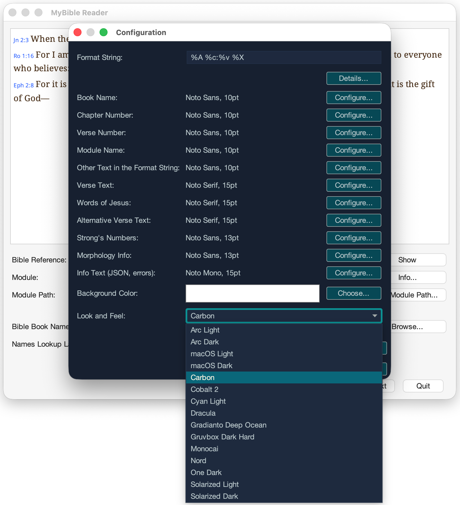

# Using the GUI

The `mybible-cli` graphical user interface (GUI) offers a powerful and intuitive way to read, study, and customize your Bible text display without using the command line. It is ideal for interactive browsing and deep customization of the look and feel.

## Main Interface Overview

The GUI is designed for ease of use with three primary components:

*   **Text Display Area:** The main pane where the formatted Bible text appears.
*   **Reference Input:** A text field where you enter the Bible reference (e.g., "John 3:16").
*   **Module Selector:** A dropdown list to choose your desired Bible translation.

## Core Functionality

### Fetching Verses

To look up a passage, simply select a module, type a reference into the input field, and press the **Show** button or hit ++enter++.

### Automatic Updates

The GUI is designed to be responsive. Changing the selected module in the dropdown list will automatically refresh the displayed text to show the same reference from the new module.

{: width="80%"}

### Copying Text with Formatting

A key feature of the GUI is its advanced copy functionality. When you copy text from the display area (++ctrl+shift+c++ / ++cmd+shift+c++ or via the **Copy** button), it places **both** plain text and rich text onto the clipboard.

This allows you to paste into any application:

*   **Plain Text:** Paste into a simple text editor.
*   **Rich Text:** Paste into a word processor or email client, preserving all fonts, colors, and styles.

## Configuration and Customization

The heart of GUI customization lies in the **Configuration** dialog, accessible by pressing the **Configure** button.

### Look&Feel and Themes

The GUI includes several built-in Look and Feels (LAFs) that change the overall appearance of the application, from button styles to window chrome.

{: width="80%"}

Furthermore, you can save all your custom style and color settings as a **Theme**. Themes can be exported, shared with other users, and imported, allowing you to maintain a consistent look across different computers or share your favorite style.

{: width="80%"}

### Customizing Fonts and Colors

You have granular control over the appearance of the text display area. In the Configuration dialog, you can customize:

*   The **background color** of the text area.
*   The **fonts, styles, and colors** for various parts of the text, including:
    *   Reference elements (book, chapter, verse number, other text, i.e. `:`).
    *   The main biblical text.
    *   Words of Jesus.
    *   Alternative biblical text (useful for interlinear translations).
    *   Strong's numbers.
    *   Morphological data.

{: width="80%"}

### Module and Book Name Settings

The GUI provides easy access to manage where your modules are stored and how book names are recognized.

*   **Module Path:** You can easily set the directory where `mybible-cli` looks for your `.sqlite3` files. For detailed instructions, see how to [Set Module Path](../modules.md#set-module-path).
*   **Book Name Mapping:** The GUI supports using custom mapping files and language settings for book name lookups, just like the CLI. For detailed instructions, see [Bible Book Names](../mapping.md).

## Extending Functionality

The **Extension Manager**, found in the Configuration dialog, lets you install and remove packages to enhance the application. You can add:

*   Application translations
*   Book name mapping files for various languages
*   Custom GUI themes

For more information, see [Extensions](../extensions.md).