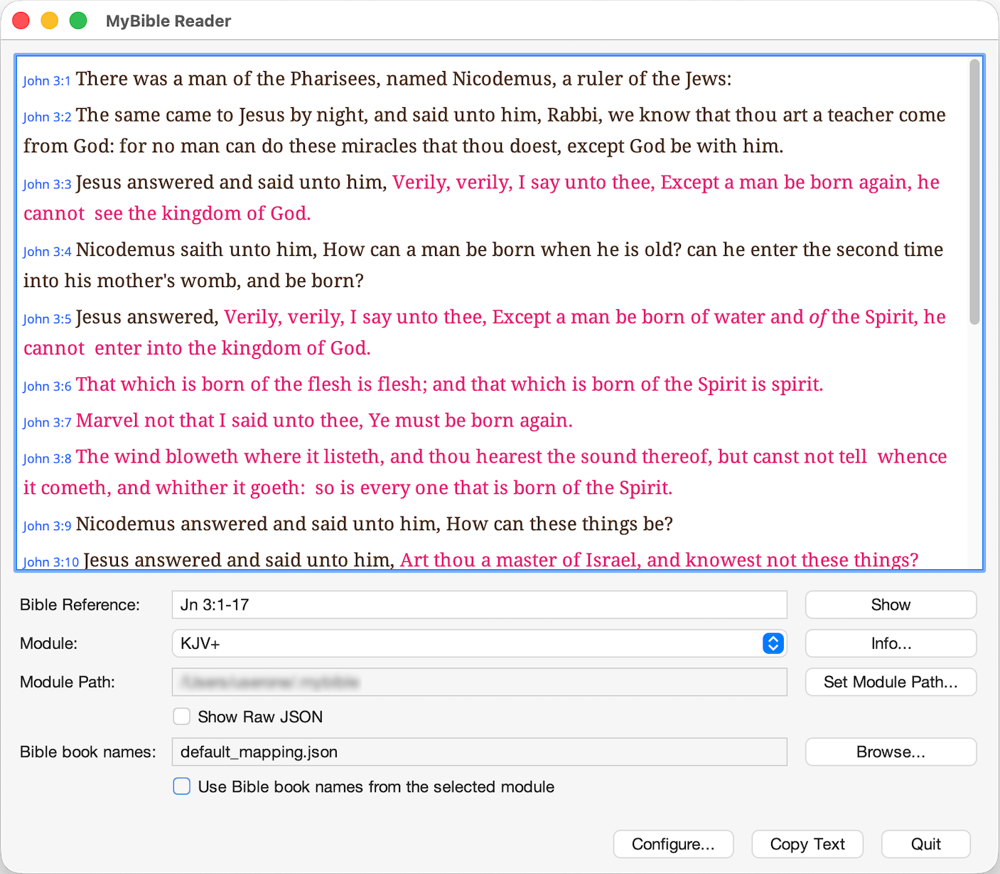

# CLI and GUI Tool to Get Text from MyBible Modules

Welcome to the documentation for **MyBible-CLI** (`mybible-cli`) — a fast, cross-platform command-line and GUI tool for accessing biblical text from [MyBible](https://mybible.zone/modules) modules.

{: width="25%"}

## About MyBible-CLI

MyBible-CLI is a small utility designed to retrieve biblical text from [MyBible](https://mybible.zone) modules on a desktop operating system without running the MyBible mobile app.

MyBible-CLI is inspired by [`diatheke`](https://wiki.crosswire.org/Frontends:Diatheke), a command-line tool for [Crosswire Sword](http://www.crosswire.org/sword/index.jsp) modules. While `diatheke` is quite powerful and convenient, it works only with Crosswire Sword modules and does not support the MyBible format, which has an extensive library of high-quality modules.

### Purpose

This tool is designed as a **quick lookup tool** for biblical text, not a comprehensive Bible study application. It excels at:

- Fast text retrieval for use in other applications
- Scriptable access to biblical text
- Integration into automated workflows
- Quick reference lookups

### Key Features

- **Fast Verse Retrieval**: Quickly fetch and display verses from any MyBible module
- **Flexible Formatting**: Control output with customizable format strings
- **Book Name Mappings**: Use default abbreviations or create custom mappings
- **Dual Interface**: Use via command line for scripting or GUI for interactive lookups
- **Cross-Platform**: Works on Windows, macOS, and Linux

{: width="48%"}
{: width="48%"}

## Next Steps

-   :fontawesome-solid-terminal:{ .lg .middle } __Command-Line Interface__

    ---

    Fast verse fetching, flexible output formatting, and easy integration with other tools.

    [:octicons-arrow-right-24: CLI Documentation](cli/index.md)

-   :fontawesome-solid-window-maximize:{ .lg .middle } __Graphical Interface__

    ---

    Simple, themeable GUI with customizable text display and keyboard shortcuts.

    [:octicons-arrow-right-24: GUI Documentation](gui/index.md)

-   :fontawesome-solid-download:{ .lg .middle } __Get Started__

    ---

    Download pre-built applications or build from source.

    [:octicons-arrow-right-24: Installation Guide](installation.md)

-   :fontawesome-solid-book:{ .lg .middle } __Examples__

    ---

    Practical examples and recipes for common use cases.

    [:octicons-arrow-right-24: View Examples](examples.md)

